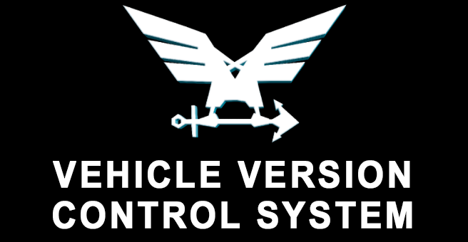

# Stormworks Vehicle Version Control System | VVCS

#### Version: 0.1.0

# Simple vehicles and microprocessors file sharing program

## About

This program is created to simplify sharing saved vehicles and microprocessors data.

Program uses GIT system to share files from **Stormworks** quickly.

If you want use this program you need to create private **GIT** repository (github recommended)
and **Private Access Token (PAT)** for it.

## Info

- Program based on: **Python 3.8+**
- GUI based on: **PySide6 (Bindings for QT)**

## Using

- **Commit changes** -> commit selected object from your data to remote repository.
- **Sync to remote** -> send commited data to remote repository.
- **Refresh** -> refreshes local and remote objects list.
- **Sync from remote** -> copy from remote to game data. Be careful! Your game objects will be overrided!

# Setup

## Manual

For manual using you need:
1. Clone this repository or **Code -> Download ZIP**
2. Setup [**GIT**](https://git-scm.com/downloads)
3. Install **Python 3.8** or newer version
4. Create your private repository (github recommended)
5. Create your [Private Access Token (PAT)](https://docs.github.com/en/authentication/keeping-your-account-and-data-secure/managing-your-personal-access-tokens) to your repository
6. Fill **config/config.json** file with private repository link, PAT and Stormworks data path
7. Install requirements **pip install -r requirements.txt**
8. Start **main.py**

If everything is correct, you would see a program with your vehicle and microprocessor names from game and empty remote data.

You can commit your first vehicle or microprocessor by selecting it in list and pressing **commit changes** button. Commited object would appear in remote list.

After all you would send **config.json** to your friends with installed program.

Now you and your friends can share and download vehicles!

**!!!Be careful with PAT!!! Don't give more access than it need!!!** 

## Exe

For using pre-build program you need:

1. Download pre-build exe program
2. Setup [**GIT**](https://git-scm.com/downloads)
3. Create your private repository (github recommended)
4. Create your [Private Access Token (PAT)](https://docs.github.com/en/authentication/keeping-your-account-and-data-secure/managing-your-personal-access-tokens) to your repository
5. Fill **config/config.json** file with private repository link, PAT and Stormworks data path or take it from your friend
6. Start **VVCS.exe**

# FAQ

> There is no objects in **Local objects** list.

Be sure to correctly fill data_path in **config.json**

> My friend don't see any object in **Remote objects** after my commit.

Be sure to correctly create **PAT** access. Check your private repository, it must contain your commited objects.

Be sure you and your friends start program after correctly filling **config.json**. Try to delete **local** directory and restart program.

### If you catch any problem, write an issue
 